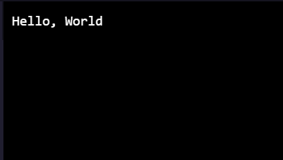

# Hello-world-in-Emojicode
## MLH Local Hack Day 
## day-5 (Daily challenges)
* Translating one of my projects from Day-1 challenge that was printing "Hello, World" into a non-mainstream language.
* I choose to write in emojicode!
# OUTOUT PREVIEW
 
